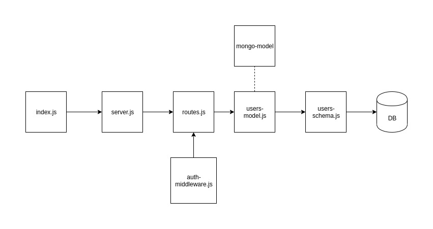

# LAB - 401-lab-13

## Bearer token

### Author: Travis Skyles

### Links and Resources
* [submission PR](https://github.com/tskyles-401-advanced-javascript/401-lab-13/pull/1)
* [travis](https://travis-ci.com/tskyles-401-advanced-javascript/401-lab-13)
* [back-end](https://tskyles-lab13.herokuapp.com/)
* [mongo-model npm](https://www.npmjs.com/package/@tskyles/mongo-model)

#### Documentation
* [api docs](https://tskyles-lab-13.herokuapp.com/api-docs/)
* [jsdocs](https://tskyles-lab-13.herokuapp.com/docs/)

### Setup
* clone repo
* npm init -y
* npm install

#### `.env` requirements
* `PORT` - Port Number
* `MONGODB_URI` - URL to the running mongo instance/db
* `CLIENT_ID` - Oauth client id
* `CLIENT_SECRET` - Oauth client secret
* `TOKEN_SERVER`  - https://github.com/login/oauth/access_token
* `API_SERVER` - https://api.github.com/user
* `REDIRECT` - http://localhost:3000/oauth
* `SECRET` - secret for signing tokens

#### How to initialize/run your server app (where applicable)
* Start App: `npm start`
* Endpoint: /api-docs
  * Returns api-documentation
* Endpoint: /docs
  * Returns JSdocs
* Endpoint: /users
  * Returns All users
* Endpoint: /user
  * Returns get user with Bearer Token
* Endpoint: /signup
  * Creates new user in the database with basic Auth
* Endpoint: /oauth
  * Creates new user in database using github oauth
* Endpoint: /signin
  * Checks if user is in database

  
#### Tests
* Unit Tests: `npm test`
* Eslint: `npm run lint`

#### UML
